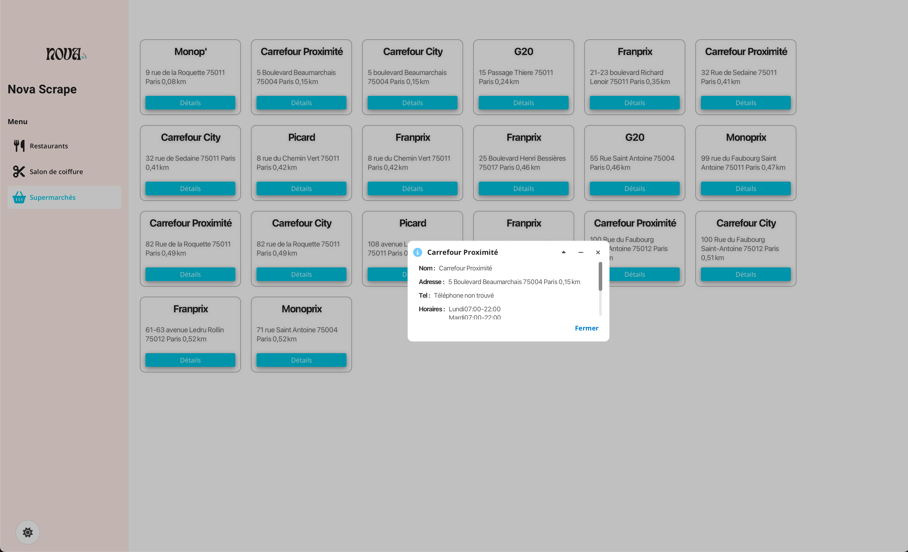
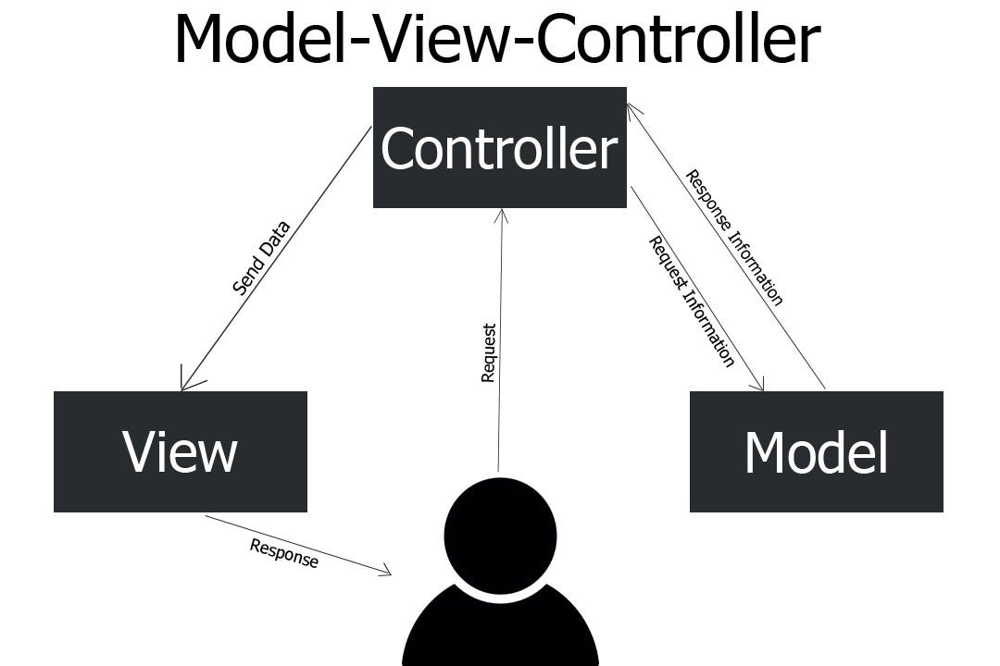

## Technology Stack

- Java 21
- JavaFX 21
- MaterialFX
- PF4J
- Log4j2
- JSoup
- Maven

## Application

## MVC

## 🧩 How to Create a Plugin for **NovaScrape**

NovaScrape uses PF4J to load plugins dynamically. If you're looking to create your own plugin, you can use the **`example-plugin`** as a starting point.

---

## 🚀 Steps to Create a Plugin (Using `example-plugin` as a Template)

1. **Clone the `example-plugin`** module:
   The `example-plugin` is a fully functional sample plugin. You can use it as a base for your own plugins. Simply copy the module and rename it according to your needs.

2. **Modify the code**:

   * Change the plugin’s main class (`ExamplePlugin.java`) and the interface it implements (`NovaScrapePlugin`).
   * Update the extension methods, plugin ID, version, etc., to suit your plugin’s functionality.

3. **Create your own `plugin.properties` file**:
   The `plugin.properties` defines the plugin ID, version, and main class. You can customize this file for your own plugin.

4. **Build and deploy**:

   * Build your plugin as a `.jar` using Maven or IntelliJ.
   * Deploy it to the `plugins/` folder in your NovaScrape project.

5. **Run NovaScrape**:
   When you start NovaScrape, it will automatically load your plugin along with any other plugins present in the `plugins/` folder.

---

## ⚙️ Example Plugin: `example-plugin`

The `example-plugin` is a great starting point for your plugin development. It demonstrates the basic structure and functionality needed to create a NovaScrape plugin. Use it to understand how to:

* Define a plugin and its extensions
* Set up the `plugin.properties` file
* Build and load your plugin

Once you’ve made your modifications, your plugin will be ready to integrate with the NovaScrape host application.

---

## 💬 Need Help?

If you run into any issues or need guidance while creating your plugin, feel free to check out the `example-plugin` code or contact @Sagbyy.
